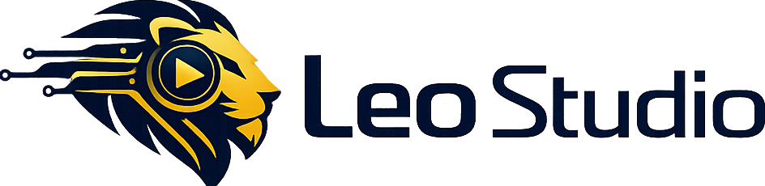
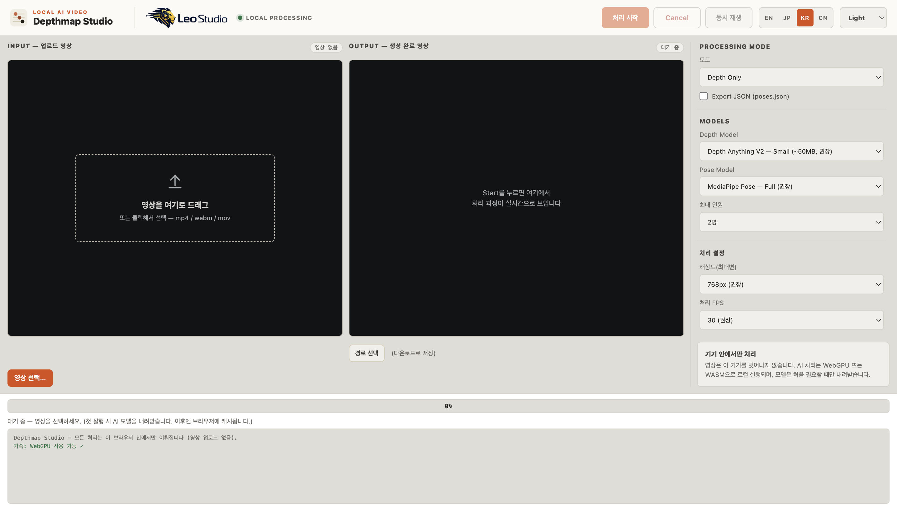
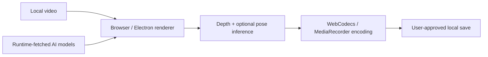

<div align="center">
  <picture>
    <source media="(prefers-color-scheme: dark)" srcset="assets/branding/leo-studio-dark.png">
    <source media="(prefers-color-scheme: light)" srcset="assets/branding/leo-studio-light.png">
    
  </picture>

  <h1>Depthmap Studio</h1>

  <p><strong>Turn ordinary video into depth maps and pose-aware motion data—privately, in your browser.</strong></p>

  <p>
    <a href="https://github.com/suyaleo/Depthmap_Studio/actions/workflows/ci.yml"></a>
    <a href="https://github.com/suyaleo/Depthmap_Studio/actions/workflows/pages.yml"></a>
    <a href="LICENSE"></a>
    
    
  </p>

  <p>
    <a href="https://suyaleo.github.io/Depthmap_Studio/"><strong>Launch Web App</strong></a>
    ·
    <a href="#docker--compose"><strong>Run with Docker</strong></a>
    ·
    <a href="#macos-desktop"><strong>Build for macOS</strong></a>
  </p>
</div>

---

<picture>
  <source media="(prefers-color-scheme: dark)" srcset="docs/screenshots/workspace-dark.png">
  <source media="(prefers-color-scheme: light)" srcset="docs/screenshots/workspace-light.png">
  
</picture>

Depthmap Studio is a local-first creator tool for extracting temporal depth maps
and optional MediaPipe pose landmarks from video. The application runs as one
implementation across the web, Docker, and the macOS desktop package. Source
video frames are processed in the browser or Electron renderer and are never
uploaded to the static host.

## Highlights

- **Depth Anything V2** through Transformers.js with WebGPU → WASM fallback
- **Pose-aware output** with optional MediaPipe skeleton overlay and `poses.json`
- **Precise segment trim** for clips up to 30 seconds
- **Depth styling** with grayscale, Inferno, Viridis, inversion, and smoothing
- **Frame-accurate output** through WebCodecs MP4 with MediaRecorder fallback
- **Four interface languages**: Korean, English, Japanese, and Chinese
- **Complete Studio theming**: Light, Dark, and live System preference
- **Local by design**: explicit model download, processing, progress, and errors

## Distribution channels

| Channel | What it provides | Command / URL |
|---|---|---|
| Web | Full static client-side application | `npm run build:web` |
| GitHub Pages | Hosted static application | https://suyaleo.github.io/Depthmap_Studio/ |
| Docker | Non-root multi-architecture nginx runtime with health/version endpoints | `docker compose up --build -d` |
| macOS | arm64 Electron application and DMG | `npm run dist:mac` |

The Web channel is the full product: inference, rendering, and encoding happen
client-side. The server only delivers static files and health metadata. The
first model run requires internet access; model files are then cached by the
browser profile.

## Web app

Requirements: Node.js 24 or newer.

```bash
npm ci
npm run build:web
npm run serve:web
```

Open `http://localhost:8790`. Runtime configuration:

```bash
DEPTHMAP_STUDIO_HOST=127.0.0.1
DEPTHMAP_STUDIO_PORT=8790
```

### Clean-machine dependency policy

The web app has no Python runtime or Python package dependencies. `npm ci`
installs Node packages only into this repository's local `node_modules`; no
global `npm` install is required or recommended.

If Python tooling is introduced later, it must use a project-local `uv`
environment (`.venv`) and a committed lockfile. Do not install project Python
packages with global `pip`. Docker remains the fully isolated runtime option.

## Docker / Compose

```bash
mkdir -p /srv/leostudio/config/depthmap-studio /srv/leostudio/data/depthmap-studio
cp .env.example /srv/leostudio/config/depthmap-studio/compose.env
docker compose --env-file /srv/leostudio/config/depthmap-studio/compose.env up --build -d
curl http://127.0.0.1:8790/api/health
curl http://127.0.0.1:8790/api/version
```

The container supports `linux/amd64` and `linux/arm64`, runs as UID `101`,
and binds port `8790` to `127.0.0.1` only. Set
`DEPTHMAP_STUDIO_DATA_DIR=/srv/leostudio/data/depthmap-studio` in the external
Compose environment file; `/data` is mounted from that host directory. Source
videos remain in the browser and are not written to the container volume.

For a Tailnet-only Ubuntu deployment, proxy the loopback endpoint with
Tailscale Serve. Do not publish this service through a public reverse proxy or
Tailscale Funnel.

Published image name:

```text
ghcr.io/suyaleo/depthmap-studio
```

Both published architectures are built and smoke-tested before release.

## macOS desktop

```bash
npm ci
npm run test:smoke
npm run dist:mac
```

The local development build is ad-hoc signed. Public release artifacts require
the release workflow and may still require Apple notarization credentials for a
warning-free first launch on another Mac.

## How it works



No application API receives video data. Transformers.js, MediaPipe, and model
files are loaded directly from the upstream providers recorded in
[`THIRD_PARTY_NOTICES.md`](THIRD_PARTY_NOTICES.md).

## Development and validation

```bash
npm run test:smoke
npm run test:e2e
npm run test:visual
npm run build:web
npm run validate:release
```

Docker and Compose readiness are also validated by GitHub Actions before public
release artifacts are created.

## Security, license, and branding

- Source code: [Apache License 2.0](LICENSE)
- Attribution: [NOTICE](NOTICE) and [Third-Party Notices](THIRD_PARTY_NOTICES.md)
- Vulnerability reporting: [SECURITY.md](SECURITY.md)
- Leo Studio names and logos: [TRADEMARKS.md](TRADEMARKS.md)

The Apache-2.0 license does not grant permission to use Leo Studio branding for
an independent derivative product.
